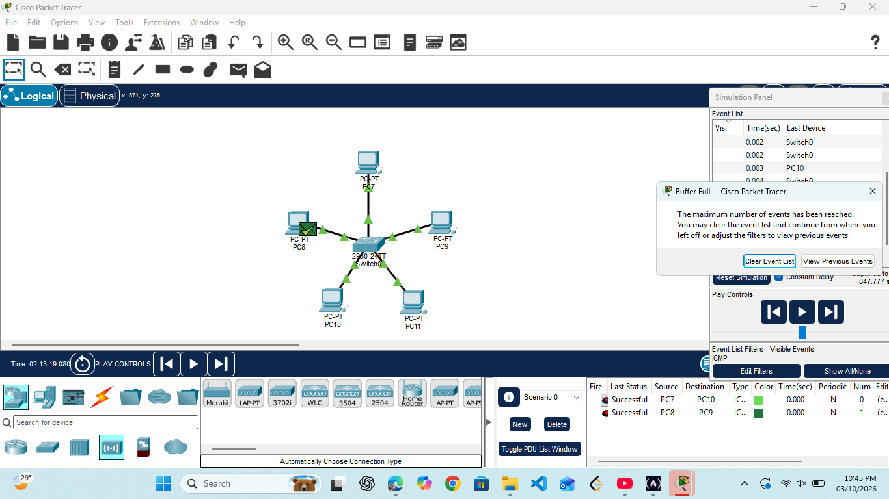
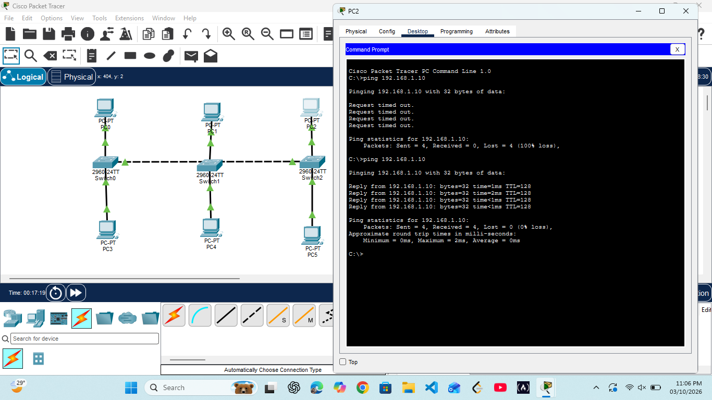
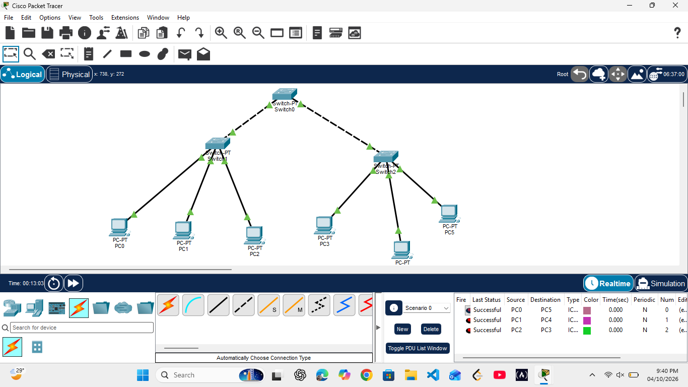
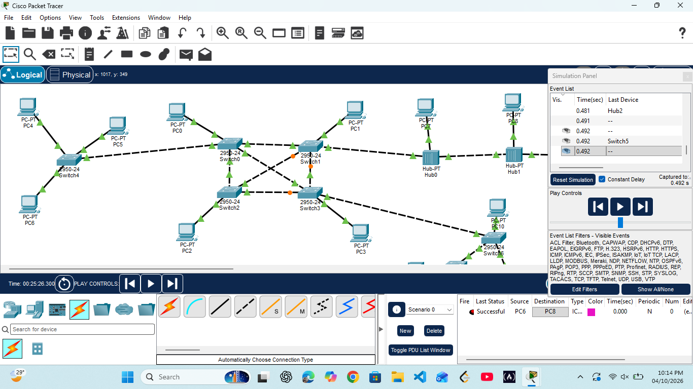
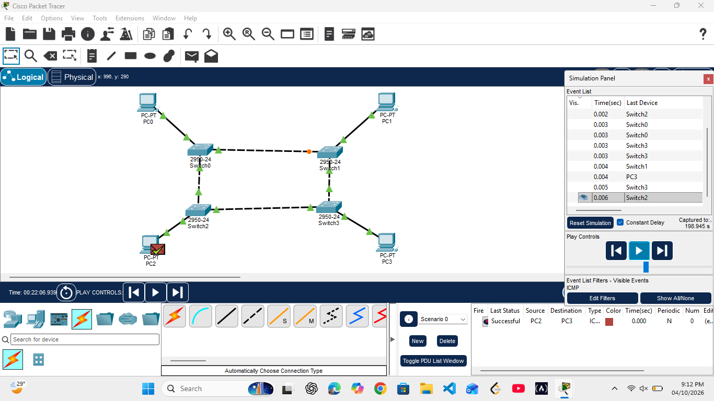
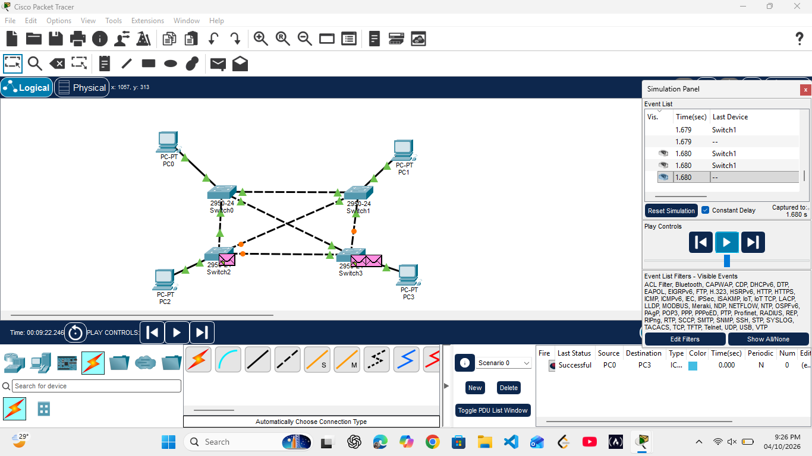

# CN-Lab-Experiments
Cisco Packet Tracer implementations and screenshots of Computer Networks laboratory experiments.

## Experiments / Network Topologies

### 1. Star Topology

### 2. Bus Topology

### 3. Tree Topology

### 4. Hybrid Topology

### 5. Ring Topology

### 6. Mesh Topology

